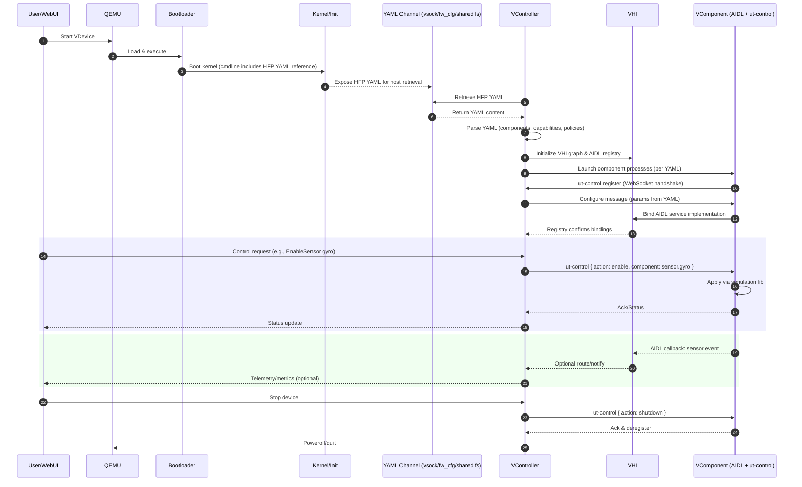

# New VDevice Architecture

This document describes the architecture of the new VDevice, where QEMU launches the bootloader and kernel, and the bootloader passes an HFP YAML (Hardware Profile) reference via the kernel command line. The VController retrieves and parses the HFP YAML to control each VComponent in the VHI layer. Each VComponent implements AIDL interfaces and simulates hardware using open-source libraries, communicating with the VController via the ut-control WebSocket protocol.

## Block Diagram

```mermaid
flowchart TB
  subgraph UI[Web UI (optional)]
  end

  subgraph VC[VController (Control Plane)]
    VC_PARSE[Parse HFP YAML\nBuild VHI topology\nManage VComponents]
    VC_WS[ut-control Message Router (WebSocket)]
  end

  subgraph VHI[VHI (Virtual Hardware Interface)]
    VHI_REG[AIDL Service Registry\nComponent Contracts]
  end

  subgraph VCOMP[VComponents Layer]
    VCMP1[Display Component\n(AIDL + WebRTC/SDL/OpenGL)]
    VCMP2[Audio Component\n(AIDL + PulseAudio/PortAudio)]
    VCMP3[Sensors Component\n(AIDL + IMU/GPS libs)]
    VCMP4[Storage Component\n(AIDL + qcow2 helpers)]
    VCMP5[Network Component\n(AIDL + TAP/TUN/virtio-net)]
  end

  subgraph GUEST[Guest Execution (QEMU domain)]
    QEMU[QEMU]
    BOOT[Bootloader]
    KERNEL[Kernel/Init]
  end

  subgraph YAML[HFP YAML Source / Channel]
    YSRC[HFP YAML file/ref\n(vsock/fw_cfg/shared fs)]
  end

  UI -->|REST/WebSocket control| VC
  QEMU --> BOOT --> KERNEL
  BOOT -->|cmdline contains HFP YAML ref| KERNEL
  YSRC -->|provide HFP YAML| VC
  VC --> VC_PARSE
  VC --> VC_WS
  VC_PARSE --> VHI
  VHI --> VHI_REG
  VC_WS <-->|ut-control (WebSocket)| VCOMP
  VHI_REG <-->|AIDL bindings| VCOMP

  classDef grp fill:#f9f9f9,stroke:#bbb,rounded:6px;
  class UI,VC,VHI,VCOMP,GUEST,YAML grp;
```

## Sequence Diagram



## ut-control Message Schema (suggested)

- Transport: WebSocket (TLS recommended). Text frames JSON.
- Common envelope:
```
{
  "type": "register" | "configure" | "control" | "status" | "event",
  "component": "<string, e.g., sensor.gyro>",
  "correlation_id": "<uuid>",
  "version": "1.0",
  "payload": { ... }
}
```
- Examples:
```
{ "type": "register", "component": "sensor.gyro", "version": "1.0" }
{ "type": "configure", "component": "sensor.gyro", "payload": { "rate_hz": 100 } }
{ "type": "control", "component": "sensor.gyro", "payload": { "action": "enable" } }
{ "type": "status", "component": "sensor.gyro", "payload": { "state": "enabled" } }
{ "type": "event", "component": "sensor.gyro", "payload": { "ts": 123456789, "x": 0.1, "y": -0.2, "z": 9.81 } }
```

## HFP YAML Outline (example)

```yaml
version: 1
device:
  name: cvd-sim
  profile: phone-medium
components:
  - id: display.main
    type: display
    backend: sdl
    params:
      width: 1080
      height: 2400
      fps: 60
  - id: audio.out
    type: audio
    backend: pulseaudio
  - id: sensor.gyro
    type: sensor
    model: imu.sim
    params:
      rate_hz: 100
  - id: net.eth0
    type: network
    backend: virtio-net
  - id: storage.root
    type: storage
    image: rootfs.qcow2
    writable: true
ut_control:
  ws_url: wss://127.0.0.1:9443/ws
  auth: token
```

## AIDL Roles (conceptual)
- Each VComponent implements its AIDL interface; AIDL provides control and callbacks into the VHI.
- Examples:
  - IVDisplay, IVAudio, IVSensor, IVNetwork, IVStorage
  - Methods: configure(Bundle), enable(), disable(), stats(), shutdown()

## Security & Operations Notes
- Authn/z on ut-control (JWT or mTLS).
- Versioning on HFP YAML and message schema.
- Health checks per component; backpressure for high-rate streams.
